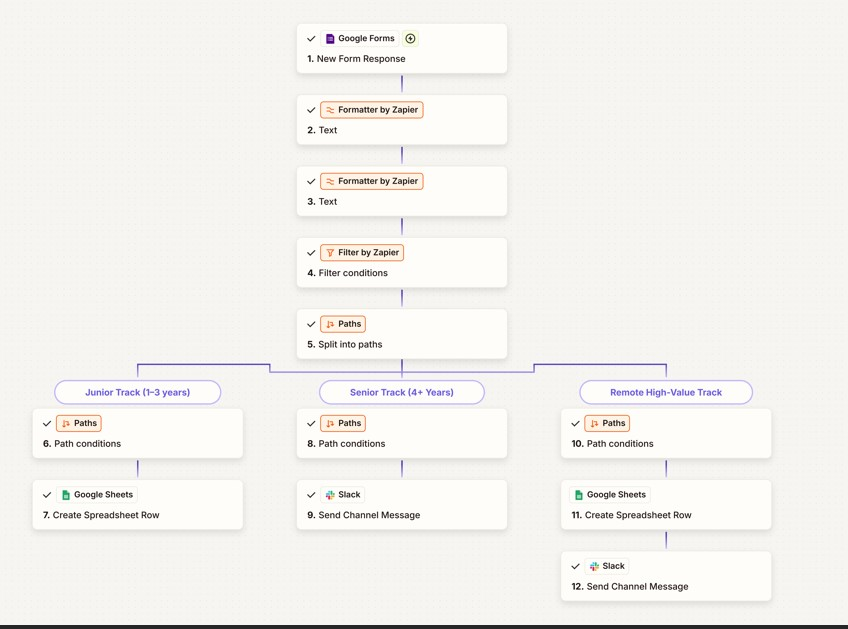

# Zapier Automated HR Hiring Pipeline | TechNova Startups
### V1 → V2 | Built with Zapier · Google Forms · Gmail · Slack · Google Sheets


---

## Project Overview

A fully automated, intelligent hiring pipeline built on **Zapier** for **TechNova Startups** — screening, routing, and notifying the right people about the right candidates, entirely without manual effort.

**The problem:** TechNova receives 20–50 applications per week. Manual screening was draining HR capacity — unqualified candidates slipping through, senior talent waiting 3–7 days for a response, and no consistent candidate acknowledgement.

**The solution:** A multi-step Zapier pipeline that screens every application automatically, routes candidates by experience level, notifies the right team instantly, and keeps HR focused only on qualified talent.

This project was built in two iterations — **V1** (9 steps, 3 paths) and **V2** (12 steps, upgraded with Delay, Email and Daily Digest).

> *"Zero manual screening hours. Senior candidates alerted within seconds. Interviews scheduled in 48 hours vs 3–7 days."*

---

## The Problem vs ✅ The Solution

| ❌ Before Automation | ✅ After Automation |
|---|---|
| HR manually reviewing every submission | Auto-trigger on every Google Form submission |
| Applicants lacking Python slipping through | Filter gate: Python + 1yr+ + supported location |
| Messy experience data: `5+`, `3-5 years` | Formatter extracts clean numeric value |
| Unsupported locations not filtered out | Location condition blocks unsupported entries |
| Senior talent waiting 3–7 days | Slack alert fires within seconds |
| No consistent candidate acknowledgement | Auto confirmation email to every qualified applicant |
| No daily visibility of pipeline | 6 PM daily digest to Slack (V2) |

---

## Application Form — Google Forms

**TechNova Software Developer Application** — 6 required fields:

| Field | Type | Used For |
|---|---|---|
| **Full Name** | Text | Split into First + Last by Formatter |
| **Email** | Text | Confirmation email + Sheets logging |
| **Years of Experience** | Text | Extracted to number by Formatter |
| **Key Skills** | Checkboxes | Filter gate — must contain Python |
| **Other Skills** | Text | Logged to Sheets / Slack |
| **Work Location** | Dropdown | Filter gate + Remote Priority routing |

---

## V1 vs V2 — What Changed

| Feature | V1 (9 Steps) | V2 (12 Steps) |
|---|---|---|
| Total steps | 9 | 12 ✅ |
| Routing paths | 3 — Junior / Senior / Remote | 2 — Junior / Senior + Digest |
| Delay before action | ❌ | ✅ 30-min buffer |
| Email to Sales Manager | ❌ | ✅ Branded HTML email |
| Daily digest summary | ❌ | ✅ 6 PM Slack batch |
| Gmail to applicant | ✅ All qualified | ✅ All qualified |
| Remote High-Value track | ✅ Sheets + Slack | Merged into Senior path |

---

## V1 — Original 12-Step Pipeline



### Architecture

```
Candidate submits Google Form
            │
  Step 1 — Google Forms Trigger
            │
  Step 2 — Formatter: Split Full Name → First + Last
            │
  Step 3 — Formatter: Extract Experience Number
            │
  Step 4 — Filter Gate ← STOP if unqualified
            │  ✅ Python in skills
            │  ✅ Experience > 0
            │  ✅ Location supported
            │
  Step 5 — Paths: Route by Experience & Location
            │
            ├──► PATH A: Junior (1–3 yrs)
            │         └── Google Sheets → Junior Applicants tab
            │
            ├──► PATH B: Senior (4+ yrs)
            │         └── Slack → #tech-interviews (instant alert)
            │
            └──► PATH C: Remote High-Value
                      ├── Google Sheets → Remote Priority tab
                      └── Slack → #tech-interviews

### V1 — 3 Routing Paths

**PATH A — Junior Track (1–3 years)**

| | |
|---|---|
| Condition | Experience < 4 AND > 1 |
| Action | Google Sheets → Junior Applicants tab |
| Status | Auto-set to `Pending HR Review` |
| Columns logged | Timestamp · First Name · Last Name · Email · Experience · Skills · Location · Other Skills · Status |

**PATH B — Senior Track (4+ years)**

| | |
|---|---|
| Condition | Experience > 3 |
| Action | Slack → `#tech-interviews` |
| Sent by | TechNova Hiring Bot |
| Message includes | Name · Email · Experience · Skills · Location · LinkedIn |
| Result | Interview scheduled within 48 hours |

**PATH C — Remote High-Value Track**

| | |
|---|---|
| Condition | Location = Fully Remote AND Python in skills |
| Action | Google Sheets (Remote Priority tab) + Slack alert |
| Review time | 24-hour priority fast track |

**Slack notifciation sent  to all Qualified Paths**

Every qualified applicant receives an instant personalised confirmation email — keeping the TechNova brand polished and candidate experience professional.


### V1 — HR Benefits

| Benefit | Detail |
|---|---|
| 🚫 **Zero Noise** | Unqualified applicants filtered silently — HR never sees them |
| 📊 **Organised Juniors** | Batch-logged to Sheets — HR reviews on their own schedule |
| ⚡ **Instant Senior Alerts** | 4+ year candidates on Slack within seconds |
| 🌍 **Remote Priority Track** | Fully Remote + Python applicants on 24-hr fast track |
| 📧 **Pro Candidate UX** | Every qualified applicant gets instant confirmation email |
| ⏱️ **24/7 Screening** | Pipeline runs continuously — no human needed at screening stage |

---

## 🆙 V2 — Upgraded 12-Step Pipeline

### What's New in V2

3 new steps added between the Filter gate and Paths split:

**Step 5 — ⏱️ Delay 30 Minutes** *(NEW)*
`Delay by Zapier → Delay For → 30 Minutes`
Pauses the Zap for 30 minutes after filter passes. Gives HR a review buffer and eliminates alert fatigue. Only qualified applicants reach this step.

**Step 6 — 📧 Email Sales Manager** *(NEW)*
`Gmail by Zapier → Send Outbound Email`
Branded HTML candidate card automatically sent after the delay.

| Field | Value |
|---|---|
| To | salesmanager@technova.com |
| Subject | `New Qualified Applicant: {{Full Name}} – {{Experience}} years` |
| Body | HTML template — candidate profile + filter pass confirmation |

**Step 7 — 📋 Append to Daily Digest** *(NEW)*
`Digest by Zapier → Append Entry and Schedule Digest`
Queues one summary line per qualified applicant all day for 6 PM batch release.


### V2 Architecture

```
Candidate submits Google Form
            │
  Step 1 — Google Forms Trigger
            │
  Step 2 — Formatter: Split Name
            │
  Step 3 — Formatter: Extract Experience
            │
  Step 4 — Filter Gate ← STOP if unqualified
            │
  Step 5 — Delay: 30 Minutes ⏱️  ← NEW
            │
  Step 6 — Gmail: Email Sales Manager  ← NEW
            │
  Step 7 — Digest: Append to Daily Queue  ← NEW
            │
  Step 8 — Paths: Route by Experience
            │
            ├──► Senior (4+ yrs) → Slack #tech-interviews
            └──► Junior (1–3 yrs) → Google Sheets

  ─────────────────────────────────────────────
  SEPARATE ZAP — Daily 6 PM Digest
  Schedule → Release Digest → Slack #hiring-daily-summary
```

### V2 — Daily 6 PM Digest (Separate Zap)

| Step | Action |
|---|---|
| 1 | Schedule by Zapier — fires every day at 6:00 PM |
| 2 | Digest: Release — pulls all queued entries from `Daily Qualified Job Apps` |
| 3 | Slack → `#hiring-daily-summary` — full batch summary + total count + @Salesmanager |

---

## 🔧 Filter Gate Detail — Step 4

Three AND conditions — fail any one and the Zap stops completely:

| # | Condition | Rule |
|---|---|---|
| 1 | **Python skill** | Key Skills (Text) Contains `Python` |
| 2 | **Experience** | Extracted Number Greater than `0` |
| 3 | **Location** | Work Location does NOT contain `Other (not supported)` |

❌ Fail any condition → Zap stops. No email. No Slack. No Sheets entry.

---

## ✅ Live Test Results

| Test | V1 | V2 |
|---|---|---|
| Filter stopped unqualified applicant | ✅ | ✅ |
| Junior logged to Google Sheets | ✅ | ✅ |
| Senior Slack alert — `#tech-interviews` | ✅ | ✅ |
| Remote track — Sheets + Slack | ✅ | — |
| Gmail confirmation sent to applicant | ✅ | ✅ |
| 30-min delay ran correctly | — | ✅ |
| HTML email to Sales Manager | — | ✅ |
| Digest appended in 1 second | — | ✅ |
| 6 PM summary — `#hiring-daily-summary` | — | ✅ |

---

## 💼 Business Impact

| Metric | Before | After V1 | After V2 |
|---|---|---|---|
| Manual screening hours | Several/day | **0** | **0** |
| Time to notify on Senior | 3–7 days | **Seconds** | **30 min + seconds** |
| Daily hiring visibility | None | None | **6 PM digest** |
| Alert fatigue | High | Medium | **Eliminated** |
| Candidate acknowledgement | Inconsistent | **100% automated** | **100% automated** |
| Remote priority tracking | Manual | **Auto-flagged** | **Auto-flagged** |

---

## 🛠️ Tech Stack

| Tool | Role |
|---|---|
| **Google Forms** | Application intake — 6 required fields |
| **Zapier Formatter** | Splits name · Extracts experience number from free text |
| **Zapier Filter** | Zero-waste qualification gate (3 AND conditions) |
| **Zapier Delay** | 30-min HR buffer (V2) |
| **Zapier Digest** | Daily batch queue — released at 6 PM (V2) |
| **Zapier Paths** | Routes Junior / Senior / Remote High-Value |
| **Gmail** | Applicant confirmation + Sales Manager HTML alert (V2) |
| **Slack** | TechNova Hiring Bot — `#tech-interviews` + `#hiring-daily-summary` |
| **Google Sheets** | Junior Applicants tab + Remote Priority tab |

---

## 📁 Repository Contents

```
zapier-hiring-pipeline/
│
├── screenshots/
│   ├── full_zap_v1_architecture.jpg
│   ├── full_zap_v2_architecture.jpg
│   ├── slack_senior_notification.jpg
│   ├── slack_daily_digest_summary.jpg
│   ├── gmail_sales_manager_email.jpg
│   ├── filter_gate.jpg
│   ├── google_sheets_junior_tab.jpg
│   └── delay_digest_steps.jpg
│
├── docs/
│   ├── TechNova_Zapier_Automation_V1_Presentation.pdf
│   └── TechNova_Zapier_Pipeline_V2_Presentation.pdf
│
└── README.md
```

---

## 🚀 Possible V3 Upgrades

| Feature | Description |
|---|---|
| 🤖 AI Scoring | ChatGPT/Claude API step to auto-score and rank candidates |
| 📅 Auto-Schedule Interviews | Calendly integration for instant interview booking |
| ❌ Rejection Emails | Auto-send polite rejection to unqualified candidates |
| 📊 ATS Integration | Connect to Greenhouse or Lever |
| 📈 Weekly Leadership Report | Auto-generate weekly hiring summary for leadership |
| 🔗 LinkedIn Auto-Sync | Pull job posting data directly from LinkedIn |

---

## 👩🏾‍💻 About the Builder

**Gloria Njorteah** — Strategic Business Analyst & AI Automation Specialist

This pipeline was built and iterated from V1 to V2 as part of a Zapier automation module — demonstrating advanced use of Filter gates, Formatter data cleaning, Paths routing, Delay buffering, Digest batching and multi-tool integrations for a real HR use case.

- 🌍 [LinkedIn](https://www.linkedin.com/in/gloria-njorteah)
- 💼 [Upwork](https://www.upwork.com/freelancers/gloinnovate)
- 🐙 [GitHub](https://github.com/Glorious75)

> *Available to build hiring automation, HR pipelines and workflow systems for your business. Let's talk.*

---

*Built with ⚡ using Zapier | TechNova Startups · HR & Hiring Automation | March 2026*
